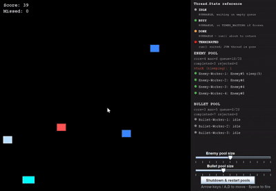

# Space Wars — Thread Pool Visualizer

A Space-Invaders-style game where every enemy and bullet is a real `java.util.concurrent` task,
built to make a bounded `ThreadPoolExecutor` visible: how it schedules work, queues it under
load, retires idle threads, and refuses tasks it can't handle. The game is the excuse; the
sidebar showing live worker state is the point.

## Demo



## The core idea: tasks, not threads

Nothing on screen owns a raw `Thread`. An enemy or a bullet is a `Runnable` whose entire time on
screen happens inside its own `run()` — a sleep-loop that moves it down (or up) the screen for as
long as it's alive. Submitting that `Runnable` to a bounded `ThreadPoolExecutor` is what puts it
in motion, and that task occupies one pool worker for its whole lifetime, not just for an instant.
Two independent pools exist:

| Pool         | Core / Max | Queue | Backs                          |
|--------------|-----------:|------:|---------------------------------|
| Enemy pool   | 4 / 6      | 20    | every falling enemy             |
| Bullet pool  | 3 / 5      | 20    | every fired bullet              |

Because each pool is bounded, more enemies than the pool can run at once simply **wait in the
executor's queue**, invisible above the top of the screen, until a worker frees up. Shrink a
pool's slider in the UI while enemies are spawning and you can watch that backpressure happen
live — queue depth climbs, then tasks start getting rejected outright once the queue is full too.

## What the sidebar shows

Every number in the sidebar comes from the pool's own introspection API
(`getActiveCount()`, `getQueue().size()`, `getCompletedTaskCount()`, etc.) — nothing is a
hand-rolled guess about what the executor is doing.

- **Per-worker rows** (`Enemy-Worker-1`, `Bullet-Worker-1`, ...), each showing what it's doing
  right now: idle, busy with a named task, just finished, or genuinely terminated.
- **`core=`/`max=`/`queue=`** — the pool's live configuration and how full its bounded queue is.
- **`completed=`/`rejected=`** — running totals straight off the executor.
- **`stuck (frozen forever):`** — how many workers are permanently pinned by a frozen enemy that
  will never release them (see below). Turns orange once it's above zero.
- **`rejected: Enemy#N (queue full)`** — flashes for a couple of seconds whenever a spawn is
  actually refused by the pool.
- A **`Thread.State` reference** panel at the top, mapping this demo's simplified states back to
  the real JVM states they represent.

## Gameplay mechanics, and what each one demonstrates

- **Red stones** die on the first hit — a task that runs, gets shot, and returns. The simple case.
- **Blue stones** survive a first hit by *freezing*: the task stops advancing the enemy and just
  keeps sleeping in a loop, genuinely parked (`Thread.sleep`, real `TIMED_WAITING`) rather than
  finishing. The sidebar shows a live countdown, `sleep(5)` → `sleep(4)` → ... From there, exactly
  one of two things happens — a second hit while frozen destroys it and frees the worker
  immediately, or after 5s with no second hit it **thaws itself** and resumes falling (and can be
  frozen again by the next hit, repeating the cycle). Either way, the worker is held doing nothing
  productive for the whole freeze window — see the full walkthrough below.
- **Rejection**: when a pool's queue *and* its max threads are both full, a new spawn is refused
  outright (`RejectedExecutionException` under the hood) instead of blocking. A rejected task
  never becomes a thread at all, so it never appears on screen — the sidebar is the only place
  that event is visible.
- **Death, with a cause**: a task that ends because it was shot (`EndCause.KILLED`) reports
  differently in the sidebar than one that just reached the bottom of the screen or left the top
  unused (`EndCause.OFFSCREEN`) — e.g. `Enemy#42 killed - thread finished` vs.
  `Enemy#42 thread finished`.
- **On-screen death animation**: a dying enemy/bullet turns into a red **X**, then an orange **O**
  (matching the sidebar's "just finished" color), fading out over ~700ms — timed to match the
  sidebar's own "thread finished" flash, so the canvas and the sidebar read as the same event.
- **Shutdown & restart**: the button calls `shutdownNow()` on both pools (interrupting every
  running task), then rebuilds them fresh at the same core/max size and clears the board —
  demonstrating pool teardown/rebuild as its own lifecycle event, distinct from any single task
  ending.

## A task's full lifecycle, step by step

Everything above is really one state machine, playing out per-task on a pool worker. Here it is
end to end, using an enemy as the example (bullets follow the same path minus the freeze step):

1. **Submitted.** `GameWorld.spawnEnemy()` calls `VisualThreadPool.submit(enemy, enemy::statusLabel)`,
   which calls the underlying `executor.execute(...)`.
2. **Accepted, or rejected outright (the failure case).** If a worker is free or there's room in
   the bounded queue, the task is accepted. If the queue *and* `maxPoolSize` are both already full,
   `execute()` throws `RejectedExecutionException` instead of blocking — `submit()` catches it,
   counts it, and remembers it for the sidebar's `rejected: Enemy#N (queue full)` flash. A
   rejected task never becomes a thread at all; that enemy simply never spawns.
3. **Running (`RUNNABLE`).** A worker picks the task off the queue, the sidebar shows it `BUSY`,
   and the enemy visibly falls.
4. **Asleep (`TIMED_WAITING`) — blue enemies only.** A bullet hit sets `frozen = true`; the same
   task keeps running, but its loop stops advancing the enemy and just calls `Thread.sleep()`
   repeatedly instead. The worker is still alive and still "busy" as far as the pool is concerned,
   but it isn't doing anything useful — the sidebar's `sleep(Ns)` countdown and the
   `stuck (sleeping):` counter both track this directly.
5. **Recovery — two ways out of step 4.** Either a second hit lands while it's frozen (destroys
   it, jumps to step 6 with `EndCause.KILLED`), or nobody hits it again and after
   `FREEZE_DURATION_MS` (5s) it **thaws itself** — `frozen` flips back to `false` from inside the
   task's own loop, no outside intervention needed — and it's back to step 3, falling again, able
   to be frozen once more by the next hit. Nothing here is permanent; every freeze eventually ends
   one way or the other.
6. **Finished.** The task's `run()` returns, either because it was killed or it reached the edge
   of the screen (`EndCause.OFFSCREEN`). The worker briefly reports `DONE` — orange, e.g.
   `Enemy#42 killed - thread finished` — for ~700ms, timed to match the on-screen X→O animation,
   before falling back to plain `idle`.
7. **Reused, or actually terminated.** Normally the *same* worker thread just waits for the next
   task (`IDLE`) — no new OS thread gets created, this is the pool doing its job. But shrink a
   pool's slider below its current worker count and an idle worker beyond the new `corePoolSize`
   will eventually time out (`keepAliveTime`) and its thread genuinely exits — shown as
   `TERMINATED`, red and struck through. This is the only step where a real JVM thread dies, as
   opposed to a task merely ending.
8. **Whole-pool teardown.** "Shutdown & restart pools" calls `shutdownNow()` on both pools at
   once, interrupting every worker regardless of what it's doing (mid-fall, mid-sleep, doesn't
   matter), pushing every worker through step 7's `TERMINATED` transition simultaneously, then
   rebuilds a fresh pool at the same core/max size and clears the board. It's the same lifecycle
   ending as step 7, just applied to every worker at once instead of one at a time.

## Running it

Requires JDK 21 and Maven.

```bash
mvn compile exec:java
```

or build a runnable jar:

```bash
mvn package
java -jar target/space-wars.jar
```

## Controls

| Key                | Action        |
|--------------------|---------------|
| `←` / `A`          | Move left     |
| `→` / `D`          | Move right    |
| `Space`            | Fire          |

The pool-size sliders and the restart button live in the sidebar and can be used mid-game.

## Project layout

```
src/main/java/com/spacewars/
├── App.java                 entry point
├── engine/
│   └── GameWorld.java        owns both pools, entity lists, collision + scoring
├── model/
│   ├── Entity.java           shared position/destroyed/EndCause state
│   ├── Enemy.java            falling task: freeze/thaw/kill logic
│   ├── EnemyKind.java        RED (one-hit) / BLUE (freeze-then-kill)
│   ├── Bullet.java           rising task
│   └── Player.java           EDT-driven, not a task
├── pool/
│   ├── VisualThreadPool.java wraps ThreadPoolExecutor: submit/resize/restart + introspection
│   ├── TrackingThreadFactory.java names workers, records real birth/death
│   ├── WorkerState.java      IDLE / BUSY / DONE / TERMINATED
│   └── WorkerSnapshot.java   one worker's point-in-time state, for painting a row
└── ui/
    ├── MainFrame.java        wires everything together, drives the game/spawn timers
    ├── GamePanel.java        rendering + keyboard input
    ├── ThreadPoolPanel.java  the live sidebar
    ├── LegendPanel.java      Thread.State reference
    └── ControlPanel.java     pool-size sliders + restart button
```

## Why this exists

Most portfolio projects that claim "concurrency experience" show a `CompletableFuture` chain and
call it done. This one makes the underlying `ThreadPoolExecutor` state — queuing, backpressure,
rejection, worker reuse, and pool teardown — something you can watch happen in real time, driven
by a game loop instead of a synthetic benchmark.
